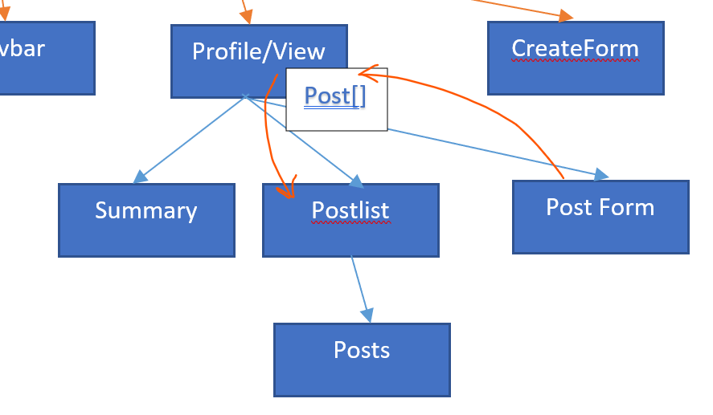

## Basic solution to share the data between components

The most basic yet expensive way to share the data between components is by adding them to their resective parent component. Then the parent class will give the data to their respective child classes as the usage requires. 

To share the data between components- mainly parents and child there is the most basic technique we can use.



As shown here, we are sharing the data between parent and child. To do this in particular way, we can use the following technique.

## Sharing data between parent/child

```html
<parent-component>
    <child-component></child-component>
</parent-component>
```

> `@input()` provides way to send data from **parent to child**. <br>`@output()` provides way to send data from **child to parent**

# Sending data to child component

`@input()` decorator signifies the child can recieve data from its parent component.

**Configuring the child class to recieve the input from parent.**
```typescript
export class ChildClass {
    @Input() dataItem = ""; // dataItem is variable that can recieve the calue from parent
}
```

**Configuring the parent to send the data**

1. In the child selector use the property binding. `<child-selector [dataItem]="currentItem">`

2. Current item must be present in the parent class.
```typescript
export class ParentClass {
    currentItem = ""; // some data to be sent
}
```

> Here `dataItem` is child's property and `currentItem` is parent's property. <br> `[]` signifies the property binding between the data

# Sending data from child to parent

`@Output()` decorator provides the feature to send the data from child to parent.

It uses the `EventEmitter` to raise an event and that event will notify the parent to change the data within.

**Configuring the child component**

1. Add custom event emitter to emit the event.
```typescript
export class ChildClass {
    @Output() customEvent = new EventEmitter<datatype-to-send>();
}
```

2. Emitting the event
```typescript
addToParent(someData: string) {
    this.customEvent.emit(someData);
}
```

3. **Setting the template of child component**
```html
<button (click)="addToParent(someData)">Add to parent list</button>
```

**Configuring the parent component**

1. Adding the function to add data in parent
```typescript
addItem(value:string) {
    this.arrayItem.push(value);
}
```

2. **Modifying the template of the parent**
```html
<parent-component (customEvent)="addItem($event)">
```

