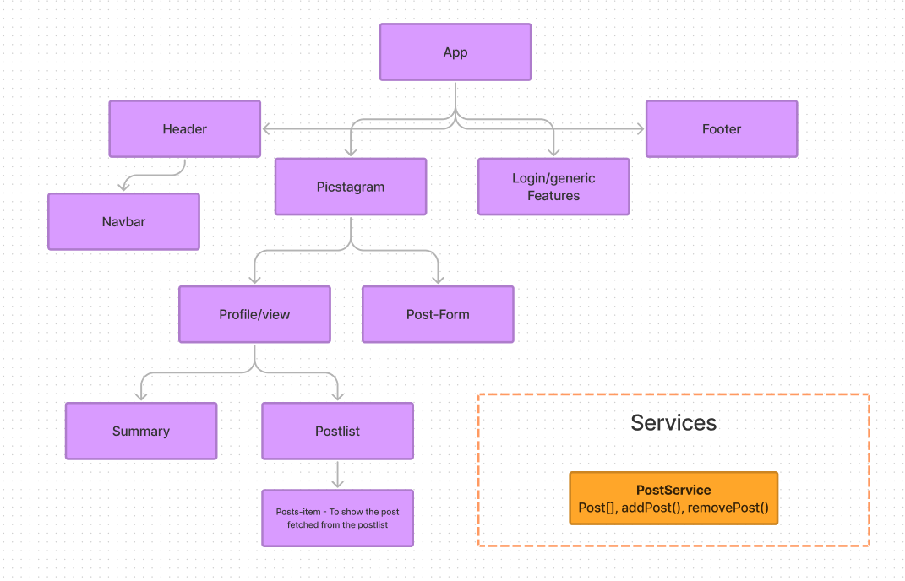

# Creating the picstagram project 
> Journey Documentation of the project

---

## Hierarchy Diagram

## What is goal of component?

To generate the decoupled experience in development. The components are grouped in parent-child model as they are going to be used.

The component can be used repeatatively once written.

1. **Header** : It consists of the `navbar` which is shared between the UIs

2. **Picstagram** : It's the view of the UI which contains the profile and create form for adding the new posts. Profile view contains of the Summary and posts.

3. **Login/generic functionalities** : These functionalities are requisite of any page. So these generic functions are added into the functionalities.

This is just a suggested prototype of the webpage, and can be changed.

### Structure of the source

- App
  - Components
        - Shared
            - Header
            - Footer
            - Nav
        - Login
        - Picstagram
            - Profile
                - Summary
                - Postlist
                    - Post item
            - PostForm
            - PostDetail
        - Register

Creating the components folder containerize each component in it.